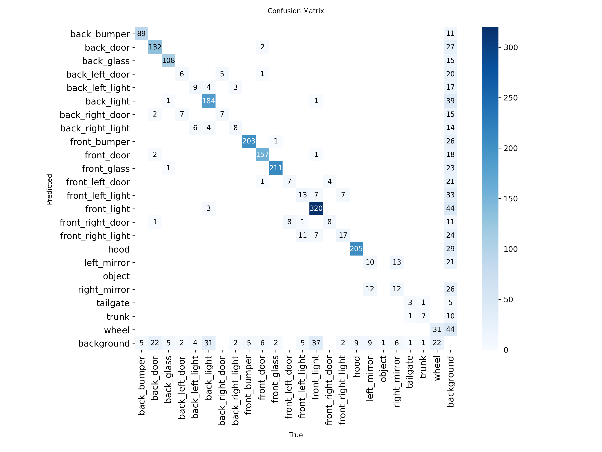
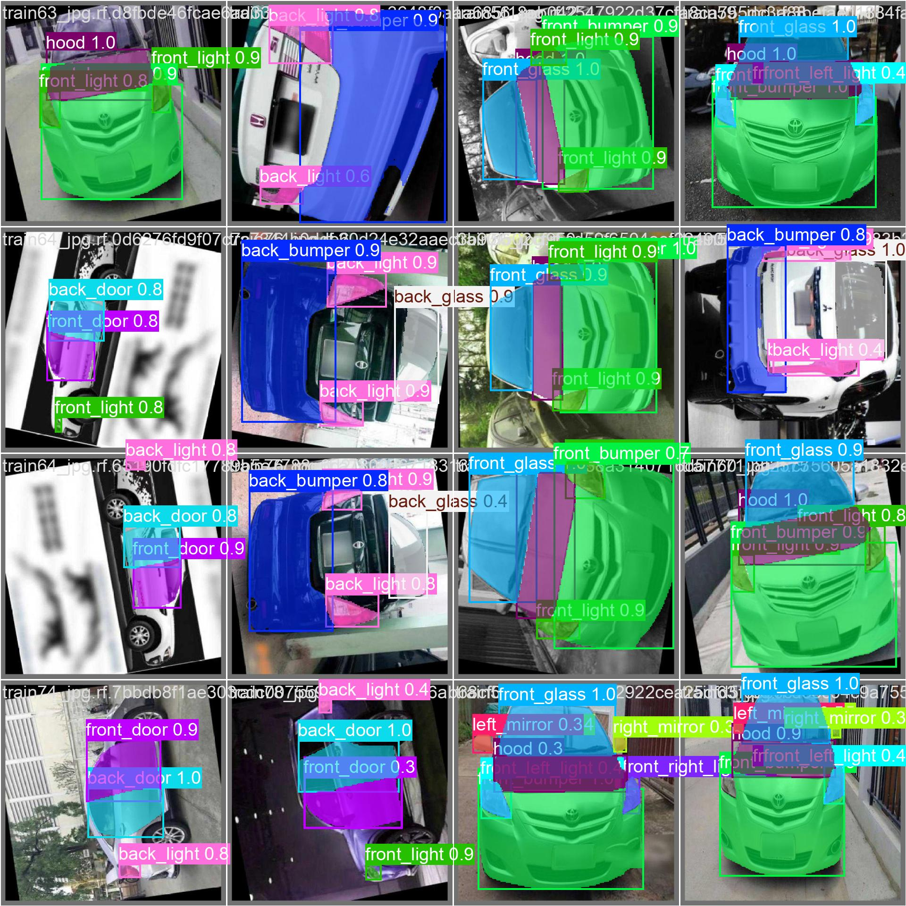
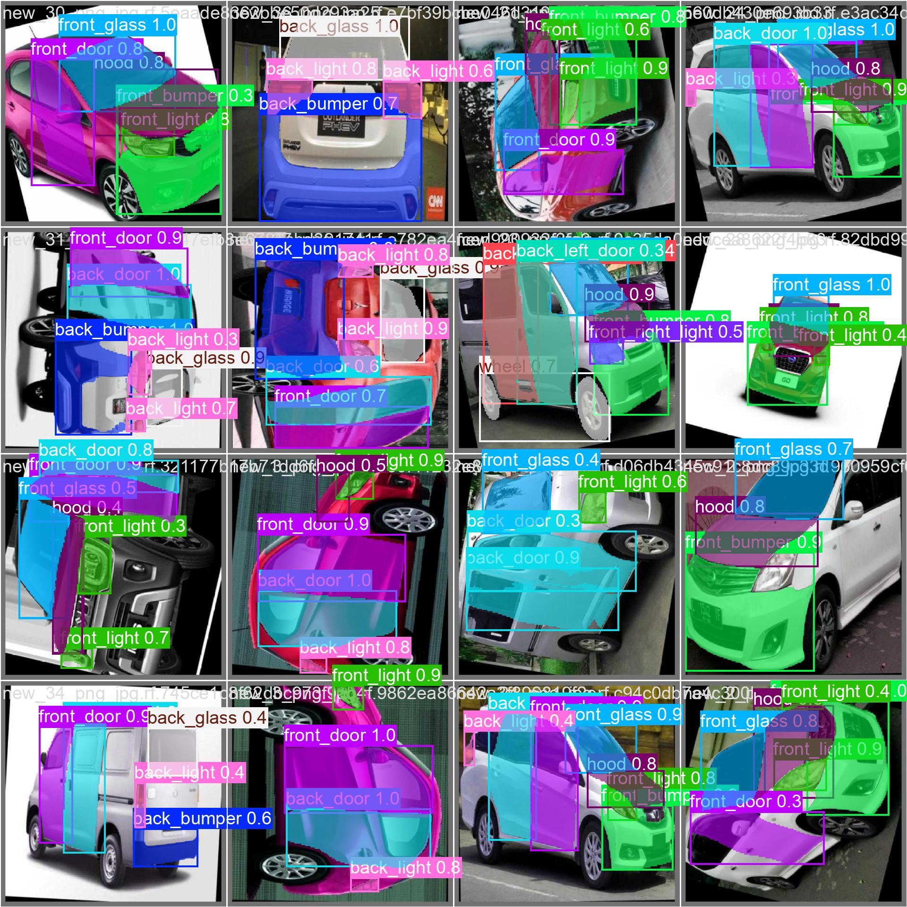

# 🚗 YOLO26 Car Parts Segmentation

This project demonstrates **car part detection and instance segmentation** using the YOLO26 segmentation model trained with the Ultralytics framework.

The model identifies multiple vehicle components such as bumpers, doors, lights, mirrors, hood, trunk, and wheels.

---

## 🔥 Project Overview

This project was trained using a custom training pipeline on Google Colab with GPU acceleration.

### Key Features

* Instance segmentation using YOLO26
* Fast inference performance
* Improved loss optimization
* Real-time compatible detection
* Works on CPU and GPU environments

---

## ⚙️ Training Command

```bash
yolo segment train data=carparts-seg.yaml model=yolo26n-seg.pt epochs=100 imgsz=640
```

---

## 🚀 Running Detection

```bash
python detect.py
```

The script loads the trained model and performs segmentation on test images.

---

## 📦 Project Files

* `detect.py` → Runs inference
* `requirements.txt` → Required libraries
* `carparts-seg.yaml` → Dataset configuration
* Validation outputs and evaluation images included below

---

## 📊 Model Results

### Confusion Matrix



---

### Validation Predictions

#### Prediction Sample 1



#### Prediction Sample 2



#### Prediction Sample 3


---


## 🧠 Classes Detected

Back bumper, doors, lights, mirrors, hood, trunk, wheels and other vehicle components (23 classes total).

---

## 🛠 Requirements

Install dependencies:

```bash
pip install -r requirements.txt
```


